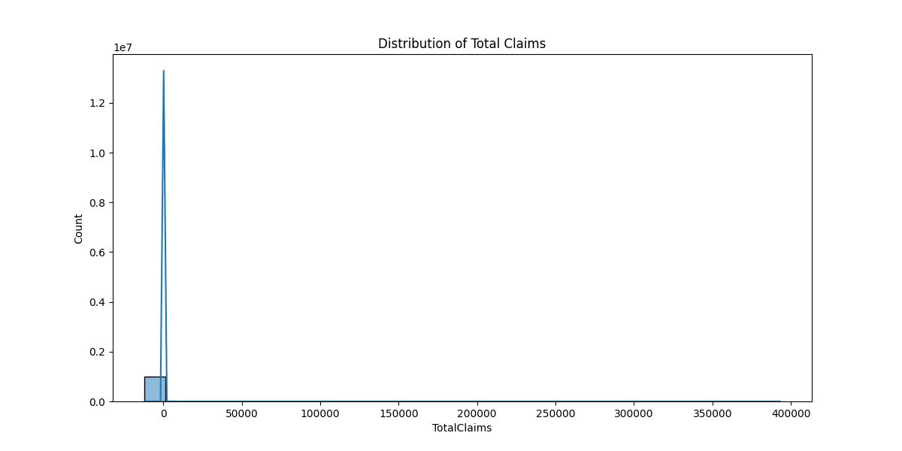
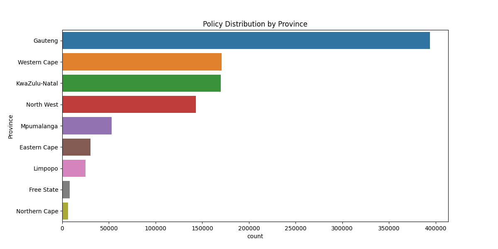
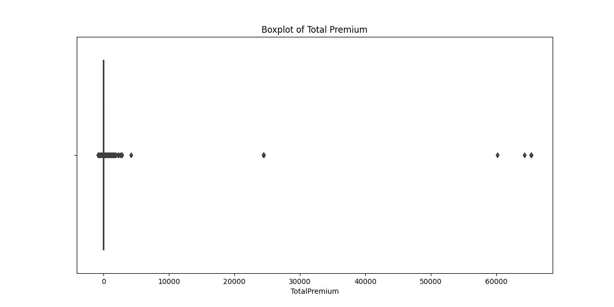
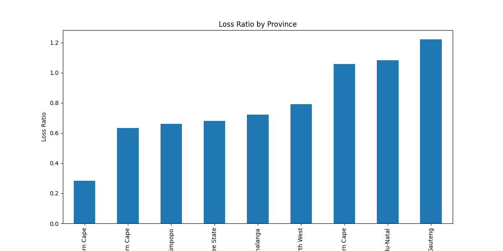
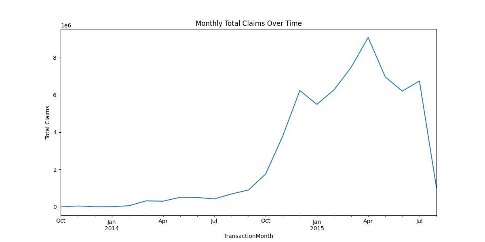

# Interim Report: Insurance Analytics Project


Generated on: 2025-06-14 12:47:57
# Exploratory Data Analysis

## 1. Data Summary


Dataset contains 1000098 rows and 52 columns.

First 5 rows of data:

```python
|    |   UnderwrittenCoverID |   PolicyID | TransactionMonth    | IsVATRegistered   | Citizenship   | LegalType         | Title   | Language   | Bank                | AccountType     | MaritalStatus   | Gender        | Country      | Province   |   PostalCode | MainCrestaZone   | SubCrestaZone   | ItemType         |      mmcode | VehicleType       |   RegistrationYear | make          | Model   |   Cylinders |   cubiccapacity |   kilowatts | bodytype   |   NumberOfDoors | VehicleIntroDate   |   CustomValueEstimate | AlarmImmobiliser   | TrackingDevice   |   CapitalOutstanding | NewVehicle         |   WrittenOff |   Rebuilt |   Converted |   CrossBorder |   NumberOfVehiclesInFleet |   SumInsured | TermFrequency   |   CalculatedPremiumPerTerm | ExcessSelected                   | CoverCategory   | CoverType   | CoverGroup           | Section             | Product                         | StatutoryClass   | StatutoryRiskType   |   TotalPremium |   TotalClaims |
|---:|----------------------:|-----------:|:--------------------|:------------------|:--------------|:------------------|:--------|:-----------|:--------------------|:----------------|:----------------|:--------------|:-------------|:-----------|-------------:|:-----------------|:----------------|:-----------------|------------:|:------------------|-------------------:|:--------------|:--------|------------:|----------------:|------------:|:-----------|----------------:|:-------------------|----------------------:|:-------------------|:-----------------|---------------------:|:-------------------|-------------:|----------:|------------:|--------------:|--------------------------:|-------------:|:----------------|---------------------------:|:---------------------------------|:----------------|:------------|:---------------------|:--------------------|:--------------------------------|:-----------------|:--------------------|---------------:|--------------:|
|  0 |                145249 |      12827 | 2015-03-01 00:00:00 | True              |               | Close Corporation | Mr      | English    | First National Bank | Current account | Not specified   | Not specified | South Africa | Gauteng    |         1459 | Rand East        | Rand East       | Mobility - Motor | 4.40692e+07 | Passenger Vehicle |               2004 | MERCEDES-BENZ | E 240   |           6 |            2597 |         130 | S/D        |               4 | 6/2002             |                119300 | Yes                | No               |               119300 | More than 6 months |          nan |       nan |         nan |           nan |                       nan |         0.01 | Monthly         |                     25     | Mobility - Windscreen            | Windscreen      | Windscreen  | Comprehensive - Taxi | Motor Comprehensive | Mobility Metered Taxis: Monthly | Commercial       | IFRS Constant       |        21.9298 |             0 |
|  1 |                145249 |      12827 | 2015-05-01 00:00:00 | True              |               | Close Corporation | Mr      | English    | First National Bank | Current account | Not specified   | Not specified | South Africa | Gauteng    |         1459 | Rand East        | Rand East       | Mobility - Motor | 4.40692e+07 | Passenger Vehicle |               2004 | MERCEDES-BENZ | E 240   |           6 |            2597 |         130 | S/D        |               4 | 6/2002             |                119300 | Yes                | No               |               119300 | More than 6 months |          nan |       nan |         nan |           nan |                       nan |         0.01 | Monthly         |                     25     | Mobility - Windscreen            | Windscreen      | Windscreen  | Comprehensive - Taxi | Motor Comprehensive | Mobility Metered Taxis: Monthly | Commercial       | IFRS Constant       |        21.9298 |             0 |
|  2 |                145249 |      12827 | 2015-07-01 00:00:00 | True              |               | Close Corporation | Mr      | English    | First National Bank | Current account | Not specified   | Not specified | South Africa | Gauteng    |         1459 | Rand East        | Rand East       | Mobility - Motor | 4.40692e+07 | Passenger Vehicle |               2004 | MERCEDES-BENZ | E 240   |           6 |            2597 |         130 | S/D        |               4 | 6/2002             |                119300 | Yes                | No               |               119300 | More than 6 months |          nan |       nan |         nan |           nan |                       nan |         0.01 | Monthly         |                     25     | Mobility - Windscreen            | Windscreen      | Windscreen  | Comprehensive - Taxi | Motor Comprehensive | Mobility Metered Taxis: Monthly | Commercial       | IFRS Constant       |         0      |             0 |
|  3 |                145255 |      12827 | 2015-05-01 00:00:00 | True              |               | Close Corporation | Mr      | English    | First National Bank | Current account | Not specified   | Not specified | South Africa | Gauteng    |         1459 | Rand East        | Rand East       | Mobility - Motor | 4.40692e+07 | Passenger Vehicle |               2004 | MERCEDES-BENZ | E 240   |           6 |            2597 |         130 | S/D        |               4 | 6/2002             |                119300 | Yes                | No               |               119300 | More than 6 months |          nan |       nan |         nan |           nan |                       nan |    119300    | Monthly         |                    584.647 | Mobility - Metered Taxis - R2000 | Own damage      | Own Damage  | Comprehensive - Taxi | Motor Comprehensive | Mobility Metered Taxis: Monthly | Commercial       | IFRS Constant       |       512.848  |             0 |
|  4 |                145255 |      12827 | 2015-07-01 00:00:00 | True              |               | Close Corporation | Mr      | English    | First National Bank | Current account | Not specified   | Not specified | South Africa | Gauteng    |         1459 | Rand East        | Rand East       | Mobility - Motor | 4.40692e+07 | Passenger Vehicle |               2004 | MERCEDES-BENZ | E 240   |           6 |            2597 |         130 | S/D        |               4 | 6/2002             |                119300 | Yes                | No               |               119300 | More than 6 months |          nan |       nan |         nan |           nan |                       nan |    119300    | Monthly         |                    584.647 | Mobility - Metered Taxis - R2000 | Own damage      | Own Damage  | Comprehensive - Taxi | Motor Comprehensive | Mobility Metered Taxis: Monthly | Commercial       | IFRS Constant       |         0      |             0 |
```


```python
|    |   UnderwrittenCoverID |   PolicyID | TransactionMonth    | IsVATRegistered   | Citizenship   | LegalType         | Title   | Language   | Bank                | AccountType     | MaritalStatus   | Gender        | Country      | Province   |   PostalCode | MainCrestaZone   | SubCrestaZone   | ItemType         |      mmcode | VehicleType       |   RegistrationYear | make          | Model   |   Cylinders |   cubiccapacity |   kilowatts | bodytype   |   NumberOfDoors | VehicleIntroDate   |   CustomValueEstimate | AlarmImmobiliser   | TrackingDevice   |   CapitalOutstanding | NewVehicle         |   WrittenOff |   Rebuilt |   Converted |   CrossBorder |   NumberOfVehiclesInFleet |   SumInsured | TermFrequency   |   CalculatedPremiumPerTerm | ExcessSelected                   | CoverCategory   | CoverType   | CoverGroup           | Section             | Product                         | StatutoryClass   | StatutoryRiskType   |   TotalPremium |   TotalClaims |
|---:|----------------------:|-----------:|:--------------------|:------------------|:--------------|:------------------|:--------|:-----------|:--------------------|:----------------|:----------------|:--------------|:-------------|:-----------|-------------:|:-----------------|:----------------|:-----------------|------------:|:------------------|-------------------:|:--------------|:--------|------------:|----------------:|------------:|:-----------|----------------:|:-------------------|----------------------:|:-------------------|:-----------------|---------------------:|:-------------------|-------------:|----------:|------------:|--------------:|--------------------------:|-------------:|:----------------|---------------------------:|:---------------------------------|:----------------|:------------|:---------------------|:--------------------|:--------------------------------|:-----------------|:--------------------|---------------:|--------------:|
|  0 |                145249 |      12827 | 2015-03-01 00:00:00 | True              |               | Close Corporation | Mr      | English    | First National Bank | Current account | Not specified   | Not specified | South Africa | Gauteng    |         1459 | Rand East        | Rand East       | Mobility - Motor | 4.40692e+07 | Passenger Vehicle |               2004 | MERCEDES-BENZ | E 240   |           6 |            2597 |         130 | S/D        |               4 | 6/2002             |                119300 | Yes                | No               |               119300 | More than 6 months |          nan |       nan |         nan |           nan |                       nan |         0.01 | Monthly         |                     25     | Mobility - Windscreen            | Windscreen      | Windscreen  | Comprehensive - Taxi | Motor Comprehensive | Mobility Metered Taxis: Monthly | Commercial       | IFRS Constant       |        21.9298 |             0 |
|  1 |                145249 |      12827 | 2015-05-01 00:00:00 | True              |               | Close Corporation | Mr      | English    | First National Bank | Current account | Not specified   | Not specified | South Africa | Gauteng    |         1459 | Rand East        | Rand East       | Mobility - Motor | 4.40692e+07 | Passenger Vehicle |               2004 | MERCEDES-BENZ | E 240   |           6 |            2597 |         130 | S/D        |               4 | 6/2002             |                119300 | Yes                | No               |               119300 | More than 6 months |          nan |       nan |         nan |           nan |                       nan |         0.01 | Monthly         |                     25     | Mobility - Windscreen            | Windscreen      | Windscreen  | Comprehensive - Taxi | Motor Comprehensive | Mobility Metered Taxis: Monthly | Commercial       | IFRS Constant       |        21.9298 |             0 |
|  2 |                145249 |      12827 | 2015-07-01 00:00:00 | True              |               | Close Corporation | Mr      | English    | First National Bank | Current account | Not specified   | Not specified | South Africa | Gauteng    |         1459 | Rand East        | Rand East       | Mobility - Motor | 4.40692e+07 | Passenger Vehicle |               2004 | MERCEDES-BENZ | E 240   |           6 |            2597 |         130 | S/D        |               4 | 6/2002             |                119300 | Yes                | No               |               119300 | More than 6 months |          nan |       nan |         nan |           nan |                       nan |         0.01 | Monthly         |                     25     | Mobility - Windscreen            | Windscreen      | Windscreen  | Comprehensive - Taxi | Motor Comprehensive | Mobility Metered Taxis: Monthly | Commercial       | IFRS Constant       |         0      |             0 |
|  3 |                145255 |      12827 | 2015-05-01 00:00:00 | True              |               | Close Corporation | Mr      | English    | First National Bank | Current account | Not specified   | Not specified | South Africa | Gauteng    |         1459 | Rand East        | Rand East       | Mobility - Motor | 4.40692e+07 | Passenger Vehicle |               2004 | MERCEDES-BENZ | E 240   |           6 |            2597 |         130 | S/D        |               4 | 6/2002             |                119300 | Yes                | No               |               119300 | More than 6 months |          nan |       nan |         nan |           nan |                       nan |    119300    | Monthly         |                    584.647 | Mobility - Metered Taxis - R2000 | Own damage      | Own Damage  | Comprehensive - Taxi | Motor Comprehensive | Mobility Metered Taxis: Monthly | Commercial       | IFRS Constant       |       512.848  |             0 |
|  4 |                145255 |      12827 | 2015-07-01 00:00:00 | True              |               | Close Corporation | Mr      | English    | First National Bank | Current account | Not specified   | Not specified | South Africa | Gauteng    |         1459 | Rand East        | Rand East       | Mobility - Motor | 4.40692e+07 | Passenger Vehicle |               2004 | MERCEDES-BENZ | E 240   |           6 |            2597 |         130 | S/D        |               4 | 6/2002             |                119300 | Yes                | No               |               119300 | More than 6 months |          nan |       nan |         nan |           nan |                       nan |    119300    | Monthly         |                    584.647 | Mobility - Metered Taxis - R2000 | Own damage      | Own Damage  | Comprehensive - Taxi | Motor Comprehensive | Mobility Metered Taxis: Monthly | Commercial       | IFRS Constant       |         0      |             0 |
```
## 2. Missing Values Analysis


Columns with missing values:

```python
|                         |               0 |
|:------------------------|----------------:|
| Bank                    | 145961          |
| AccountType             |  40232          |
| MaritalStatus           |   8259          |
| Gender                  |   9536          |
| mmcode                  |    552          |
| VehicleType             |    552          |
| make                    |    552          |
| Model                   |    552          |
| Cylinders               |    552          |
| cubiccapacity           |    552          |
| kilowatts               |    552          |
| bodytype                |    552          |
| NumberOfDoors           |    552          |
| VehicleIntroDate        |    552          |
| CustomValueEstimate     | 779642          |
| CapitalOutstanding      |      2          |
| NewVehicle              | 153295          |
| WrittenOff              | 641901          |
| Rebuilt                 | 641901          |
| Converted               | 641901          |
| CrossBorder             | 999400          |
| NumberOfVehiclesInFleet |      1.0001e+06 |
```


```python
|                         |               0 |
|:------------------------|----------------:|
| Bank                    | 145961          |
| AccountType             |  40232          |
| MaritalStatus           |   8259          |
| Gender                  |   9536          |
| mmcode                  |    552          |
| VehicleType             |    552          |
| make                    |    552          |
| Model                   |    552          |
| Cylinders               |    552          |
| cubiccapacity           |    552          |
| kilowatts               |    552          |
| bodytype                |    552          |
| NumberOfDoors           |    552          |
| VehicleIntroDate        |    552          |
| CustomValueEstimate     | 779642          |
| CapitalOutstanding      |      2          |
| NewVehicle              | 153295          |
| WrittenOff              | 641901          |
| Rebuilt                 | 641901          |
| Converted               | 641901          |
| CrossBorder             | 999400          |
| NumberOfVehiclesInFleet |      1.0001e+06 |
```
## 3. Descriptive Statistics


Descriptive statistics for numeric columns:

```python
|       |   UnderwrittenCoverID |       PolicyID |    PostalCode |           mmcode |   RegistrationYear |    Cylinders |   cubiccapacity |   kilowatts |   NumberOfDoors |   CustomValueEstimate |   NumberOfVehiclesInFleet |       SumInsured |   CalculatedPremiumPerTerm |   TotalPremium |     TotalClaims |
|:------|----------------------:|---------------:|--------------:|-----------------:|-------------------:|-------------:|----------------:|------------:|----------------:|----------------------:|--------------------------:|-----------------:|---------------------------:|---------------:|----------------:|
| count |            1.0001e+06 |     1.0001e+06 |    1.0001e+06 | 999546           |         1.0001e+06 | 999546       |      999546     | 999546      |   999546        |        220456         |                         0 |      1.0001e+06  |                 1.0001e+06 |     1.0001e+06 |      1.0001e+06 |
| mean  |       104818          |  7956.68       | 3020.6        |      5.48777e+07 |      2010.23       |      4.04664 |        2466.74  |     97.2079 |        4.01925  |        225531         |                       nan | 604173           |               117.876      |    61.9055     |     64.8612     |
| std   |        63293.7        |  5290.04       | 2649.85       |      1.36038e+07 |         3.26139    |      0.29402 |         442.801 |     19.3933 |        0.468314 |        564516         |                       nan |      1.50833e+06 |               399.702      |   230.285      |   2384.07       |
| min   |            1          |    14          |    1          |      4.0412e+06  |      1987          |      0       |           0     |      0      |        0        |         20000         |                       nan |      0.01        |                 0          |  -782.577      | -12002.4        |
| 25%   |        55143          |  4500          |  827          |      6.00569e+07 |      2008          |      4       |        2237     |     75      |        4        |        135000         |                       nan |   5000           |                 3.2248     |     0          |      0          |
| 50%   |        94083          |  7071          | 2000          |      6.00584e+07 |      2011          |      4       |        2694     |    111      |        4        |        220000         |                       nan |   7500           |                 8.4369     |     2.17833    |      0          |
| 75%   |       139190          | 11077          | 4180          |      6.00584e+07 |      2013          |      4       |        2694     |    111      |        4        |        280000         |                       nan | 250000           |                90          |    21.9298     |      0          |
| max   |       301175          | 23246          | 9870          |      6.50654e+07 |      2015          |     10       |       12880     |    309      |        6        |             2.655e+07 |                       nan |      1.26362e+07 |             74422.2        | 65282.6        | 393092          |
```


```python
|       |   UnderwrittenCoverID |       PolicyID |    PostalCode |           mmcode |   RegistrationYear |    Cylinders |   cubiccapacity |   kilowatts |   NumberOfDoors |   CustomValueEstimate |   NumberOfVehiclesInFleet |       SumInsured |   CalculatedPremiumPerTerm |   TotalPremium |     TotalClaims |
|:------|----------------------:|---------------:|--------------:|-----------------:|-------------------:|-------------:|----------------:|------------:|----------------:|----------------------:|--------------------------:|-----------------:|---------------------------:|---------------:|----------------:|
| count |            1.0001e+06 |     1.0001e+06 |    1.0001e+06 | 999546           |         1.0001e+06 | 999546       |      999546     | 999546      |   999546        |        220456         |                         0 |      1.0001e+06  |                 1.0001e+06 |     1.0001e+06 |      1.0001e+06 |
| mean  |       104818          |  7956.68       | 3020.6        |      5.48777e+07 |      2010.23       |      4.04664 |        2466.74  |     97.2079 |        4.01925  |        225531         |                       nan | 604173           |               117.876      |    61.9055     |     64.8612     |
| std   |        63293.7        |  5290.04       | 2649.85       |      1.36038e+07 |         3.26139    |      0.29402 |         442.801 |     19.3933 |        0.468314 |        564516         |                       nan |      1.50833e+06 |               399.702      |   230.285      |   2384.07       |
| min   |            1          |    14          |    1          |      4.0412e+06  |      1987          |      0       |           0     |      0      |        0        |         20000         |                       nan |      0.01        |                 0          |  -782.577      | -12002.4        |
| 25%   |        55143          |  4500          |  827          |      6.00569e+07 |      2008          |      4       |        2237     |     75      |        4        |        135000         |                       nan |   5000           |                 3.2248     |     0          |      0          |
| 50%   |        94083          |  7071          | 2000          |      6.00584e+07 |      2011          |      4       |        2694     |    111      |        4        |        220000         |                       nan |   7500           |                 8.4369     |     2.17833    |      0          |
| 75%   |       139190          | 11077          | 4180          |      6.00584e+07 |      2013          |      4       |        2694     |    111      |        4        |        280000         |                       nan | 250000           |                90          |    21.9298     |      0          |
| max   |       301175          | 23246          | 9870          |      6.50654e+07 |      2015          |     10       |       12880     |    309      |        6        |             2.655e+07 |                       nan |      1.26362e+07 |             74422.2        | 65282.6        | 393092          |
```
## 4. Univariate Analysis


Distribution of Total Claims:


Policy Distribution by Province:


Boxplot of Total Premium:

## 5. Bivariate Analysis


Loss Ratio by Province:

```python
| Province      |        0 |
|:--------------|---------:|
| Eastern Cape  | 0.633813 |
| Free State    | 0.680758 |
| Gauteng       | 1.22202  |
| KwaZulu-Natal | 1.08269  |
| Limpopo       | 0.661199 |
| Mpumalanga    | 0.720897 |
| North West    | 0.790367 |
| Northern Cape | 0.282699 |
| Western Cape  | 1.05947  |
```


```python
| Province      |        0 |
|:--------------|---------:|
| Eastern Cape  | 0.633813 |
| Free State    | 0.680758 |
| Gauteng       | 1.22202  |
| KwaZulu-Natal | 1.08269  |
| Limpopo       | 0.661199 |
| Mpumalanga    | 0.720897 |
| North West    | 0.790367 |
| Northern Cape | 0.282699 |
| Western Cape  | 1.05947  |
```


Monthly Total Claims:

```python
| TransactionMonth   |      TotalClaims |
|:-------------------|-----------------:|
| 2013-10            |      0           |
| 2013-11            |  50585.1         |
| 2013-12            |   9283.39        |
| 2014-01            |  12436.9         |
| 2014-02            |  62989.3         |
| 2014-03            | 322785           |
| 2014-04            | 306864           |
| 2014-05            | 518043           |
| 2014-06            | 504536           |
| 2014-07            | 428982           |
| 2014-08            | 693420           |
| 2014-09            | 908902           |
| 2014-10            |      1.76469e+06 |
| 2014-11            |      3.79425e+06 |
| 2014-12            |      6.23747e+06 |
| 2015-01            |      5.49452e+06 |
| 2015-02            |      6.26765e+06 |
| 2015-03            |      7.47498e+06 |
| 2015-04            |      9.07683e+06 |
| 2015-05            |      6.96311e+06 |
| 2015-06            |      6.20418e+06 |
| 2015-07            |      6.75121e+06 |
| 2015-08            |      1.01982e+06 |
```


```python
| TransactionMonth   |      TotalClaims |
|:-------------------|-----------------:|
| 2013-10            |      0           |
| 2013-11            |  50585.1         |
| 2013-12            |   9283.39        |
| 2014-01            |  12436.9         |
| 2014-02            |  62989.3         |
| 2014-03            | 322785           |
| 2014-04            | 306864           |
| 2014-05            | 518043           |
| 2014-06            | 504536           |
| 2014-07            | 428982           |
| 2014-08            | 693420           |
| 2014-09            | 908902           |
| 2014-10            |      1.76469e+06 |
| 2014-11            |      3.79425e+06 |
| 2014-12            |      6.23747e+06 |
| 2015-01            |      5.49452e+06 |
| 2015-02            |      6.26765e+06 |
| 2015-03            |      7.47498e+06 |
| 2015-04            |      9.07683e+06 |
| 2015-05            |      6.96311e+06 |
| 2015-06            |      6.20418e+06 |
| 2015-07            |      6.75121e+06 |
| 2015-08            |      1.01982e+06 |
```

